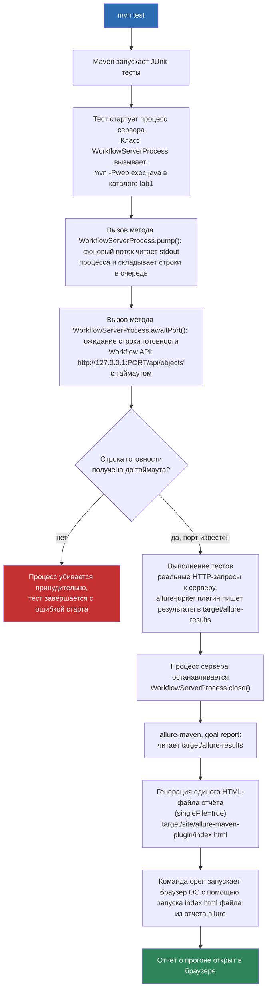

# Диаграмма прогона `mvn test`

Вертикальная схема одного прогона автотестов: от команды `mvn test` до открытия
готового Allure-отчёта в браузере.

```mermaid
flowchart TD
    A["mvn test"] --> B["Maven запускает JUnit-тесты"]
    B --> C["Тест стартует процесс сервера<br/>Класс WorkflowServerProcess вызывает#58;<br/>mvn -Pweb exec:java в каталоге lab1"]
    C --> D["Вызов метода WorkflowServerProcess.pump()#58; фоновый поток читает stdout<br/>процесса и складывает строки в очередь"]
    D --> E["Вызов метода WorkflowServerProcess.awaitPort()#58; ожидание строки готовности<br/>'Workflow API: http://127.0.0.1:PORT/api/objects'<br/>с таймаутом"]
    E --> F{"Строка готовности<br/>получена до таймаута?"}
    F -- "нет" --> F1["Процесс убивается принудительно,<br/>тест завершается с ошибкой старта"]
    F -- "да, порт известен" --> G["Выполнение тестов<br/>реальные HTTP-запросы к серверу,<br/>allure-jupiter плагин пишет результаты в target/allure-results"]
    G --> H["Процесс сервера останавливается<br/>WorkflowServerProcess.close()"]
    H --> J["allure-maven, goal report:<br/>читает target/allure-results"]
    J --> K["Генерация единого HTML-файла отчёта<br/>(singleFile=true)<br/>target/site/allure-maven-plugin/index.html"]
    K --> L["Команда open запускает браузер ОС с помощью запуска index.html файла из отчета allure"]
    L --> M["Отчёт о прогоне открыт в браузере"]

    style A fill:#2b6cb0,color:#fff
    style M fill:#2f855a,color:#fff
    style F1 fill:#c53030,color:#fff
```
